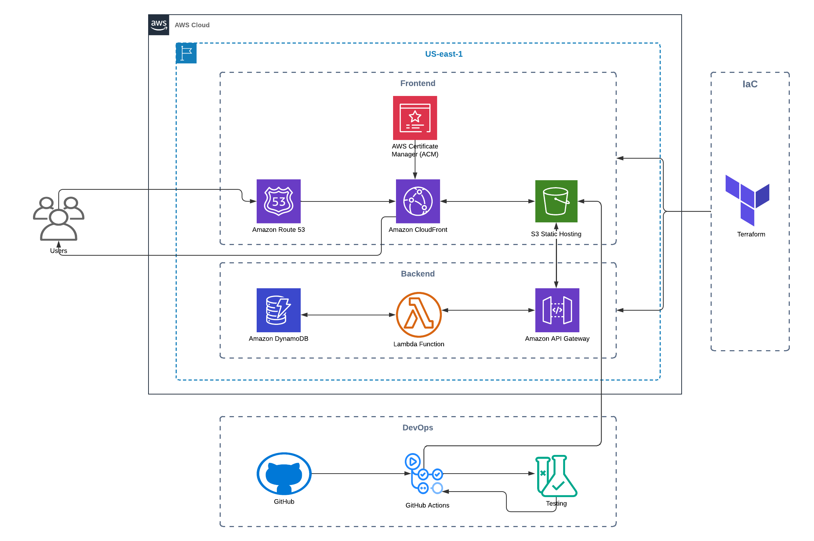

# Cloud Resume Challenge — Anas Tarek

A serverless portfolio website built on AWS as part of the [Cloud Resume Challenge](https://cloudresumechallenge.dev/). Live at **[anastarek.com](https://anastarek.com)**



## Architecture

The site runs on a fully serverless AWS stack:

**Frontend:** S3 (static hosting) → CloudFront (CDN + HTTPS) → Route 53 (custom domain) → ACM (SSL/TLS)

**Backend:** API Gateway → Lambda (Python) → DynamoDB — powers a real-time visitor counter

**Infrastructure:** All provisioned with Terraform. Five GitHub Actions workflows handle CI/CD — frontend deploy, Lambda deploy, infrastructure changes, full deploy, and tests.

## Features

- Responsive design with slide-in mobile menu, horizontal scroll carousels, and scroll-snap
- 6 scroll-triggered animations: tilt hover, staggered entrance, count-up counters, timeline draw-in, parallax hero, glow pulse
- Certificate showcase organized by category (Cloud, DevOps, Achievements) with expandable grids
- Real-time visitor counter (API Gateway + Lambda + DynamoDB)
- Contact form, SEO meta tags, Open Graph for LinkedIn/Twitter previews
- Automated deployments on every push to `main`

## Tech Stack

| Layer          | Tools                                                    |
|----------------|----------------------------------------------------------|
| Frontend       | HTML, CSS, JavaScript                                    |
| Hosting        | AWS S3, CloudFront, Route 53, ACM                        |
| Backend        | AWS Lambda (Python), API Gateway, DynamoDB               |
| IaC            | Terraform                                                |
| CI/CD          | GitHub Actions                                           |
| Containers     | Docker, Kubernetes, OpenShift                            |
| Config Mgmt    | Ansible                                                  |
| OS             | Linux (RHEL)                                             |

## Project Structure

```
cloud-resume-challenge/
├── frontend/           # Static site (HTML, CSS, JS, images)
├── backend/            # Lambda function code (Python)
├── terraform/          # Infrastructure as Code
├── tests/              # Automated tests
├── diagrams/           # Architecture diagrams
└── .github/workflows/  # CI/CD pipelines
    ├── frontend-deploy.yml
    ├── lambda-deploy.yml
    ├── infrastructure-deploy.yml
    ├── deploy-all.yml
    └── test.yml
```

## Setup & Deployment

### Prerequisites
- AWS CLI configured with appropriate credentials
- Terraform installed
- Node.js (for testing)

### Deploy Infrastructure
```bash
cd terraform
terraform init
terraform plan
terraform apply
```

### Deploy Frontend
```bash
aws s3 sync frontend/ s3://your-bucket-name
aws cloudfront create-invalidation --distribution-id YOUR_DIST_ID --paths "/*"
```

### GitHub Actions Secrets Required
- `AWS_ACCESS_KEY_ID`
- `AWS_SECRET_ACCESS_KEY`
- `CLOUDFRONT_DISTRIBUTION_ID`

Push to `main` and the pipelines handle the rest — S3 sync, CloudFront invalidation, Lambda update, and Terraform apply all run automatically.

## Certifications

This project reflects skills validated by:

**Cloud:** AWS Certified Cloud Practitioner, Huawei HCCDA & HCCDP, Oracle OCI 2025 Foundations, AWS Academy (Cloud Architecting, Foundations, Security)

**DevOps & Linux:** NTI Cloud DevOps Accelerator, Terraform (Coursera), Red Hat System Administration I & II, RHEL Automation with Ansible, OpenShift Administration & Development

## Connect

- **LinkedIn:** [linkedin.com/in/anastarek](https://www.linkedin.com/in/anastarek)
- **GitHub:** [github.com/Anas990978](https://github.com/Anas990978)
- **Email:** anastarek10777@gmail.com
- **Blog Post:** [My Cloud Resume Challenge Journey](https://www.linkedin.com/pulse/my-cloud-resume-challenge-journey-building-serverless-anas-tarek-dy6ic/)
